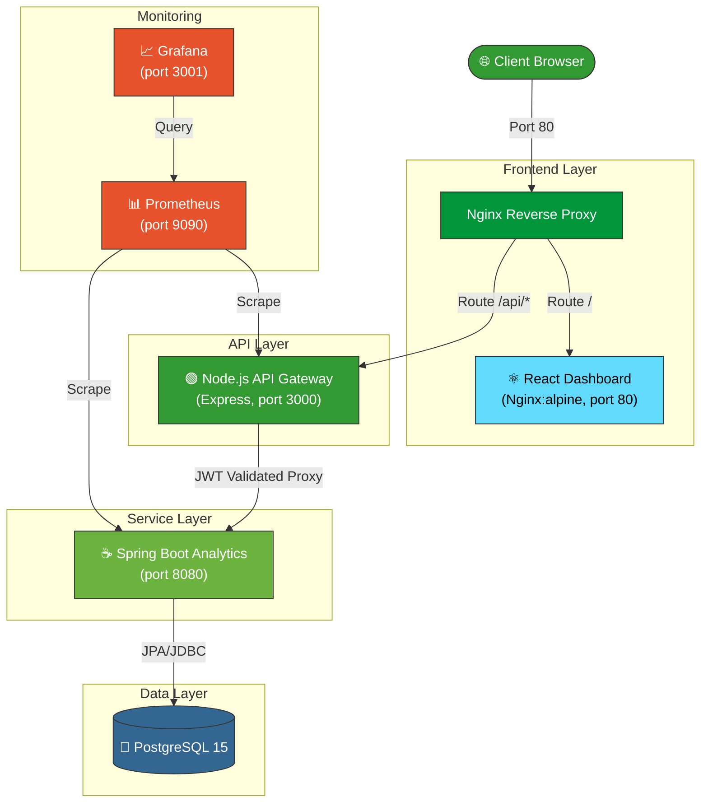

<div align="center">

<h1>🚀 Orion — Multi-Service CI/CD Platform</h1>
<p><strong>A production-grade DevOps portfolio project demonstrating automated pipelines, Docker orchestration, microservice architecture, and real-time monitoring.</strong></p>

[](https://github.com/deewakar05/Orion-cicd-platform/actions/workflows/ci-cd.yml)
[](https://reactjs.org/)
[](https://nodejs.org/)
[](https://spring.io/projects/spring-boot)
[](https://www.postgresql.org/)
[](https://www.docker.com/)
[](https://nginx.org/)
[](https://prometheus.io/)
[](https://grafana.com/)
[](LICENSE)

</div>

---

## 📖 Overview

**Orion** is a full-stack, containerized DevOps platform built to simulate a real-world production engineering environment. It features a React dashboard, two backend microservices (Node.js and Spring Boot) talking to a shared PostgreSQL database, a live monitoring stack (Prometheus + Grafana), and a fully automated 7-stage GitHub Actions CI/CD pipeline — all orchestrated with Docker Compose.

> Built as part of a university DevOps coursework project and enhanced to production-grade standards with JWT auth, structured logging, health-check orchestration, multi-stage Docker builds, and rate-limiting.

---

## ✨ Features

| Feature | Details |
|:---|:---|
| **7-Stage CI/CD Pipeline** | `frontend-lint → frontend-build → node-tests → java-tests → docker-build → integration → deploy` |
| **React Dashboard** | JWT-protected login, signup, live analytics view via Vite + Tailwind CSS |
| **API Gateway** | Node.js/Express with Helmet, CORS, rate-limiting, and Winston structured logging |
| **Analytics Microservice** | Spring Boot 3.2 + JPA with actuator health, JaCoCo coverage, and metrics endpoints |
| **Multi-Stage Docker Builds** | Optimized images with non-root users; frontend served via Nginx on port 80 |
| **PostgreSQL Orchestration** | Persistent data, health-check-guarded startup ordering in Docker Compose |
| **Prometheus + Grafana** | Live container metrics scraped and visualized on a Grafana dashboard |
| **Security Hardening** | bcrypt hashing, JWT tokens (1h expiry), non-root containers, no committed secrets |
| **Test Coverage** | Jest/Supertest (Node) + JUnit 5/JaCoCo (Java) with coverage threshold enforcement |

---

## 🏗️ Architecture



### Startup Order (Docker Compose dependency chain)
```
postgres (healthy) → java-service (healthy) → node-service (healthy) → frontend → nginx
```

---

## 🛠️ Tech Stack

| Layer | Technology |
|:---|:---|
| **Frontend** | React 19, Vite 8, Tailwind CSS 3, Axios |
| **Reverse Proxy** | Nginx Alpine |
| **API Gateway** | Node.js 20, Express, Helmet, Rate-Limit, Winston |
| **Analytics Service** | Java 17, Spring Boot 3.2, Spring Data JPA, Actuator |
| **Database** | PostgreSQL 15 Alpine |
| **Authentication** | JWT (`jsonwebtoken`) + bcrypt (10 rounds) |
| **Containerization** | Docker (multi-stage builds), Docker Compose |
| **CI/CD** | GitHub Actions (7 jobs) |
| **Monitoring** | Prometheus + Grafana |
| **Testing** | Jest, Supertest (Node) · JUnit 5, JaCoCo (Java) |

---

## 📁 Project Structure

```
Orion-cicd-platform/
├── .github/
│   └── workflows/
│       └── ci-cd.yml           # 7-stage GitHub Actions pipeline
├── frontend/                   # React + Vite dashboard
│   ├── src/
│   │   ├── pages/              # Login.jsx, Signup.jsx, Dashboard.jsx
│   │   └── services/           # api.js (Axios instance)
│   ├── Dockerfile              # Multi-stage: node:20-alpine build → nginx:alpine serve
│   ├── eslint.config.js        # ESLint Flat Config (v9+)
│   └── package.json
├── node-service/               # Express API Gateway
│   ├── src/
│   │   ├── routes/             # auth.js, dashboard.js, analytics.js
│   │   ├── middleware/         # auth.js, validators.js, errorHandler.js
│   │   └── utils/              # logger.js (Winston)
│   ├── tests/
│   │   └── app.test.js         # Jest + Supertest integration tests
│   └── Dockerfile              # Multi-stage: node:20-alpine deps → production
├── java-service/               # Spring Boot Analytics Microservice
│   ├── src/
│   │   ├── main/               # Controllers, services, models
│   │   └── test/               # JUnit 5 + MockMvc test suite
│   ├── Dockerfile              # Multi-stage: Maven build → JRE runtime
│   └── pom.xml
├── nginx/
│   └── nginx.conf              # Reverse proxy: / → frontend:80, /api → node:3000
├── prometheus/
│   └── prometheus.yml          # Scrape config for node-service + java-service
├── docker-compose.yml          # Full stack orchestration
├── .env.example                # Environment variable template
└── README.md
```

---

## 🔄 CI/CD Pipeline

The pipeline is defined in [`.github/workflows/ci-cd.yml`](.github/workflows/ci-cd.yml) and runs on every push or pull request to `main`.

```
┌─────────────────┐  ┌──────────────────┐
│ 🎨 frontend-lint │  │ 🏗️ frontend-build │  ← parallel with backend jobs
└────────┬────────┘  └────────┬─────────┘
         └──────────┬─────────┘
                    │
        ┌───────────┼───────────┐
        │           │           │
┌───────▼───┐ ┌────▼────┐      │
│ 🟢 node-  │ │ ☕ java- │      │
│   tests   │ │  tests  │      │
└───────┬───┘ └────┬────┘      │
        └──────────┤            │
                   ▼            │
           ┌───────────────┐    │
           │ 🐳 docker-    │◄───┘
           │    build      │
           └───────┬───────┘
                   ▼
           ┌───────────────┐
           │ 🔗 integration │
           │     test      │
           └───────┬───────┘
                   ▼
           ┌───────────────┐
           │ 🚀 deploy     │ (main branch only)
           └───────────────┘
```

**Pipeline behaviour:**
- `frontend-build` depends on `frontend-lint` — broken JSX won't reach Docker
- `docker-build` depends on all 4 test/lint/build jobs passing
- `integration-test` starts the full Docker Compose stack and polls health endpoints
- `deploy` only runs on push to `main`; push to `dev` stops after `integration-test`

---

## 🐳 Local Setup

### Prerequisites
- **Docker Desktop** v24+ (with Docker Compose v2)
- **Git**
- *(Optional for local dev)* Node.js 20, Java 17, Maven 3.9

### 1. Clone the repository
```bash
git clone https://github.com/deewakar05/Orion-cicd-platform.git
cd Orion-cicd-platform
```

### 2. Configure environment variables
```bash
cp .env.example .env
# Open .env and set a strong JWT_SECRET and POSTGRES_PASSWORD
```

### 3. Start the full stack
```bash
docker compose up --build -d
```

### 4. Verify services are running
```bash
# Container status
docker compose ps

# Node.js gateway health
curl http://localhost:3000/health

# Java analytics health
curl http://localhost:8080/actuator/health
```

### 5. Access the application
| Service | URL |
|:---|:---|
| **React Dashboard** | http://localhost |
| **Node.js API Gateway** | http://localhost:3000 |
| **Java Analytics Service** | http://localhost:8080 |
| **Prometheus** | http://localhost:9090 |
| **Grafana** | http://localhost:3001 (admin / admin) |

### 6. Tear down
```bash
docker compose down -v --remove-orphans
```

---

## 🖥️ Frontend Routes

| Route | Page | Auth Required |
|:---|:---|:---|
| `/` | Redirects to login | No |
| `/login` | Login page | No |
| `/signup` | Signup page | No |
| `/dashboard` | Main dashboard & analytics | ✅ JWT |

---

## 🔌 API Endpoints

### Node.js Gateway (`localhost:3000`)

| Method | Endpoint | Auth | Description |
|:---|:---|:---|:---|
| `GET` | `/health` | None | Service health status |
| `POST` | `/api/auth/signup` | None | Register a new user |
| `POST` | `/api/auth/login` | None | Login, returns JWT |
| `POST` | `/api/auth/logout` | None | Logout (client-side) |
| `GET` | `/api/dashboard` | Bearer JWT | Dashboard summary |
| `GET` | `/api/analytics` | Bearer JWT | Proxy → Java `/reports` |
| `GET` | `/api/analytics/metrics` | Bearer JWT | Proxy → Java `/metrics` |
| `GET` | `/api/analytics/logs` | Bearer JWT | Proxy → Java `/logs` |

### Java Analytics Service (`localhost:8080`)

| Method | Endpoint | Description |
|:---|:---|:---|
| `GET` | `/actuator/health` | Spring Boot health check |
| `GET` | `/reports` | List analytics reports |
| `GET` | `/reports/{id}` | Single report by ID |
| `GET` | `/reports/summary` | Report statistics summary |
| `GET` | `/metrics` | Platform + JVM metrics |
| `GET` | `/metrics/build` | CI/CD build metrics |
| `GET` | `/metrics/system` | JVM and system metrics |
| `GET` | `/logs` | Platform log entries |

---

## 🔑 Environment Variables

Copy `.env.example` to `.env` before running locally.

| Variable | Default | Description |
|:---|:---|:---|
| `JWT_SECRET` | `change-this` | Secret for JWT signing — **must change in production** |
| `JWT_EXPIRES_IN` | `1h` | Token validity window |
| `POSTGRES_DB` | `devopsdb` | Database name |
| `POSTGRES_USER` | `devops_admin` | Database username |
| `POSTGRES_PASSWORD` | `changeme_in_production` | Database password — **must change** |
| `JPA_DDL_AUTO` | `update` | Hibernate schema strategy |
| `LOG_LEVEL` | `debug` | Node.js log verbosity |
| `NODE_ENV` | `development` | Node environment |
| `APP_ENV` | `development` | Spring Boot environment label |

---

## 📊 Monitoring

### Prometheus
Access at **http://localhost:9090**

Configured in [`prometheus/prometheus.yml`](prometheus/prometheus.yml) to scrape:
- Node.js API Gateway metrics
- Java Analytics Service actuator metrics

### Grafana
Access at **http://localhost:3001** — default credentials: `admin` / `admin`

Add a Prometheus data source pointing to `http://prometheus:9090` inside Docker, then import dashboards for Node.js and JVM metrics.

---

## 🔒 Security Notes

- Passwords hashed with **bcrypt** (10 salt rounds) — plaintext never persisted
- JWT tokens signed with a configurable secret, expire after 1 hour
- **Helmet.js** security headers on all Node.js responses
- **Express Rate-Limiter** on auth endpoints (brute-force protection)
- Docker containers run as **non-root users** (`appuser`)
- No secrets committed — all sensitive values via environment variables
- `.env` listed in `.gitignore`

---

## 🐛 Troubleshooting

**Frontend lint fails locally**
```bash
cd frontend && npm install && npm run lint
```

**Java service never becomes healthy**
```bash
docker compose logs java-service --tail=50
```
Usually caused by PostgreSQL not being fully ready. The `start_period: 90s` healthcheck window handles this. If it persists, run `docker compose down -v` and restart.

**`npm ci` fails in CI**
```bash
# After adding/removing dependencies, always run:
cd frontend && npm install
git add frontend/package-lock.json
git commit -m "chore: sync lockfile"
```

**Port already in use**
```bash
lsof -i :80   # Nginx
lsof -i :3000 # Node.js
lsof -i :8080 # Java
```

**Full rebuild from scratch**
```bash
docker compose down -v --remove-orphans
docker compose up --build -d
```

---

## 📈 Future Enhancements

- [ ] Persist Node.js auth users in PostgreSQL (replace in-memory store)
- [ ] Add Spring Data JPA to persist analytics reports
- [ ] Add Flyway for database migrations
- [ ] Configure Grafana dashboards as code (provisioning)
- [ ] Add Redis cache for session tokens
- [ ] Implement CI/CD deployment to cloud (AWS ECS / Railway)

---

## 📦 Frontend Dependency Management

After any dependency change, always run `npm install` (not `npm ci`) locally to regenerate the lockfile, then commit **both** `package.json` and `package-lock.json`. The GitHub Actions pipeline uses the strict `npm ci` command which requires a perfectly synchronized lockfile.

```bash
cd frontend && npm install
git add frontend/package.json frontend/package-lock.json
git commit -m "chore(frontend): sync lockfile"
```

---

## 🤝 Contributing

1. Fork the repository
2. Create a feature branch (`git checkout -b feature/my-feature`)
3. Ensure all tests pass: `npm test` and `mvn verify`
4. Commit with a clear message following Conventional Commits
5. Open a Pull Request against the `dev` branch

---

## 📜 License

Distributed under the MIT License. See [`LICENSE`](LICENSE) for details.

---

## 👨‍💻 Author

**Deewakar Kumar**
- GitHub: [@deewakar05](https://github.com/deewakar05)
