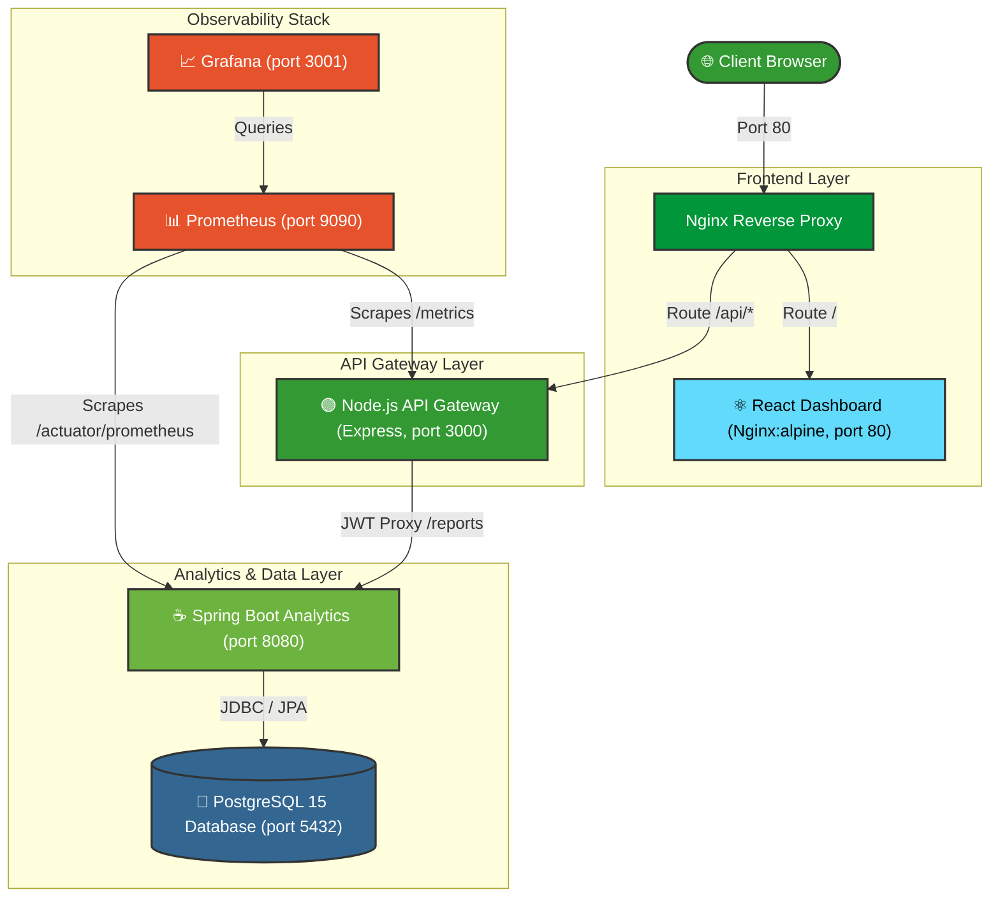
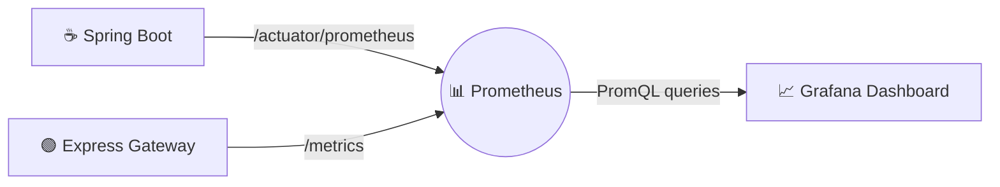

<div align="center">

# 🚀 Orion: Automated Multi-Service CI/CD & Observability Platform

<p><strong>A production-grade, enterprise-ready DevOps showcase demonstrating end-to-end automated pipelines, container orchestration, microservices architecture, and real-time system monitoring.</strong></p>

[](https://github.com/deewakar05/Orion-cicd-platform/actions/workflows/ci-cd.yml)
[](https://react.dev/)
[](https://vite.dev/)
[](https://tailwindcss.com/)
[](https://nodejs.org/)
[](https://spring.io/projects/spring-boot)
[](https://www.postgresql.org/)
[](https://www.docker.com/)
[](https://nginx.org/)
[](https://prometheus.io/)
[](https://grafana.com/)
[](LICENSE)

---

### [🌐 Live Demo](http://localhost) | [📖 API Documentation](#-api-endpoints) | [📊 Monitoring Guide](#-monitoring--observability) | [🐛 Troubleshooting](#-troubleshooting)

</div>

---

## 1. 📖 Overview

**Orion** is a state-of-the-art, fully containerized multi-service platform designed to showcase modern DevOps, site reliability engineering (SRE), and full-stack software development principles. Built as a monorepo, Orion integrates a responsive **React 19** frontend dashboard, a secure **Node.js/Express API Gateway**, and a high-performance **Java Spring Boot 3.2 Analytics Microservice** backed by a **PostgreSQL 15** database. 

The entire runtime stack is orchestrated seamlessly via **Docker Compose** behind an **Nginx Reverse Proxy**. Crucially, the repository is guarded by an automated **7-stage GitHub Actions CI/CD pipeline** that enforces code quality, unit testing, integration verification, Docker image bundling, and deployment preparations on every commit.

This repository serves as a university capstone-ready project and a recruiter-friendly showcase, proving how containerization, automated testing, API gateway patterns, database isolation, and observability can be brought together into a cohesive production-grade environment.

---

## 2. 🎯 Why This Project Was Built

In contemporary cloud-native engineering, the boundary between software development and infrastructure operations is virtually non-existent. Orion was conceived to bridge this gap by simulating a real-world, high-traffic microservices infrastructure. The primary academic and architectural objectives of this project are:

*   **Polyglot Microservice Architecture:** Showcasing how services written in different runtimes (Node.js/JavaScript and Spring Boot/Java) communicate reliably using isolated RESTful APIs and proxy mechanisms.
*   **Security-First Gateway Design:** Demonstrating how to securely handle client authentication and rate-limiting at a single entry-point (API Gateway) while shielding downstream analytical microservices.
*   **Robust Container Orchestration:** Eliminating the "it works on my machine" problem by containerizing every service using optimized multi-stage Docker builds and managing dependencies using rigid startup health checks.
*   **Continuous Integration & Verification:** Demonstrating how to prevent broken software from reaching production by running a rigorous 7-stage CI/CD workflow that checks style, executes unit tests, builds containers, and spins up ephemeral environments to perform end-to-end integration tests.
*   **End-to-End Observability:** Proving that production health cannot be guessed; it must be monitored. Orion exposes Prometheus telemetry endpoints across both services and visualizes operational KPIs inside Grafana.

---

## 3. ✨ Key Features

| Domain | Feature Details | Architectural Value |
| :--- | :--- | :--- |
| **CI/CD Pipeline** | Fully automated 7-stage pipeline (`frontend-lint → frontend-build → node-tests → java-tests → docker-build → integration-test → deploy`). | Enforces strict code quality and prevents broken builds from merging. |
| **Microservice Core** | Polyglot backend comprising an Express Gateway and a Spring Boot Analytics engine. | Leverages the speed of Node.js for routing and the reliability of Spring Boot for data processing. |
| **React Dashboard** | Responsive web client built with Vite, Tailwind CSS, and custom protected-route hooks. | Delivers a responsive, slick UI displaying real-time platform analytics. |
| **API Gateway** | Express-based proxy serving as a single ingress point with Helmet, CORS, and rate-limiting. | Decouples front-end routing from microservices while securing the backend. |
| **Data Architecture** | PostgreSQL 15 database storing system records, secured inside a private Docker bridge network. | Offers isolated, durable, and persistent storage with schema auto-updates. |
| **Docker Compose** | Strict healthcheck-guarded startup ordering ensuring zero runtime start crashes. | Guarantees PostgreSQL is healthy before Java starts, and Java is healthy before Node starts. |
| **Observability** | Scraping microservice telemetry with Prometheus and dashboarding with Grafana. | Delivers live insight into JVM metrics, Express response times, and system resources. |
| **Hardened Security** | Bcrypt hashing, JWT tokens with short-lived expiries, and non-root Docker execution. | Protects database credentials, user sessions, and shields host OS from container escapes. |

---

## 4. 🏗️ Architecture & Component Flow

Orion utilizes a tiered microservices topology. Nginx operates as the reverse proxy on port `80`, routing traffic to the React frontend container or forwarding `/api/*` endpoints to the Node.js API Gateway, which subsequently communicates with the Java Analytics service inside a private Docker network.



### ⏳ Docker Compose Container Startup Sequence

To eliminate initial boot failures, the platform implements a rigid dependency chain using Docker health checks:
```text
[postgres] (healthy)
      │
      ▼
[java-service] (healthy via Actuator)
      │
      ▼
[node-service] (healthy via Express /health)
      │
      ▼
[frontend] & [nginx] (active, routing traffic)
```

---

## 5. 🛠️ Tech Stack Reference

| Component | Technology | Version | Purpose |
| :--- | :--- | :--- | :--- |
| **Frontend UI** | React | `^19.2.6` | Component-driven user interface and dashboard views |
| **Frontend Bundler** | Vite | `^8.0.12` | Ultra-fast local development and asset bundling |
| **Styles** | Tailwind CSS | `^3.4.19` | Modern utility-first CSS styling system |
| **Client HTTP** | Axios | `^1.16.1` | Asynchronous, promise-based backend requests |
| **Reverse Proxy** | Nginx | `alpine` | Dynamic routing, proxy caching, static file serving |
| **API Gateway** | Node.js / Express | `20.x` | Requests parsing, middleware authentication, gateway routing |
| **Analytics Service**| Java / Spring Boot | `17` / `3.2` | Data analytics engine, system reports service, Actuator |
| **Database** | PostgreSQL | `15-alpine` | Persistent system storage and query transaction logging |
| **Auth Cryptography**| JWT / Bcrypt | `^9.0` / `^5.1`| Session token issuance and database password hashing |
| **Monitoring Core** | Prometheus | `latest` | Time-series database scraping operational telemetry |
| **Visualisation** | Grafana | `latest` | Interactive telemetry metrics reporting dashboards |
| **Unit Testing** | Jest / JUnit 5 | `^29.x` / `5.x` | Local and CI test harness execution suites |

---

## 6. 📁 Project Structure

```text
Orion-cicd-platform/
├── .github/
│   └── workflows/
│       └── ci-cd.yml           # 7-stage unified GitHub Actions pipeline
├── frontend/                   # React 19 Client Dashboard
│   ├── src/
│   │   ├── pages/              # Login, Signup, Dashboard views
│   │   └── services/           # Axios interceptors and gateway API bindings
│   ├── Dockerfile              # Multi-stage: Node.js 20 compilation -> Nginx serve
│   ├── eslint.config.js        # ESLint flat config (v9+)
│   ├── package.json            # Frontend dependency specifications
│   └── vite.config.js          # Vite compilation settings
├── node-service/               # Express API Gateway
│   ├── src/
│   │   ├── routes/             # Authentication & Analytics proxy routes
│   │   ├── middleware/         # JWT validator, Rate Limiter, Error Handler
│   │   └── utils/              # Winston structured logging utility
│   ├── tests/                  # Jest + Supertest API integration suites
│   ├── Dockerfile              # Multi-stage production node environment
│   └── package.json            # Gateway configurations and test scripts
├── java-service/               # Spring Boot Analytics Backend
│   ├── src/
│   │   ├── main/               # Analytics controller, JPA model & service files
│   │   └── test/               # JUnit 5 WebMvcTest suite configuration
│   ├── Dockerfile              # Multi-stage: Maven builder -> Temurin 17 JRE
│   └── pom.xml                 # Spring Boot starter dependency manager
├── nginx/
│   └── nginx.conf              # Reverse proxy configuration mapping / & /api
├── prometheus/
│   └── prometheus.yml          # Scrape target config pointing to microservices
├── docker-compose.yml          # Container coordination configuration
├── .env.example                # Shell template defining system settings
└── README.md                   # Highly detailed platform documentation
```

---

## 7. 📸 Screenshots Placeholder Showcase

*(To integrate real screenshots into your portfolio, replace the paths below with your saved PNG/JPG assets inside a `docs/screenshots/` directory)*

```carousel

<!-- slide -->

<!-- slide -->

<!-- slide -->

<!-- slide -->

<!-- slide -->

```

> 💡 **Recruiter Tip:** *To populate these placeholders, launch the environment locally (instructions below), capture screenshots of your browser pages, terminal screen, and GitHub actions log, and commit them inside `docs/screenshots/`!*

---

## 8. 🐳 Local Setup & Launch Instructions

Follow these clear, sequential steps to launch the entire multi-service stack in your local development environment.

### 📋 Prerequisites
Ensure you have the following installed on your machine:
*   **Docker Desktop** (v24.0.0 or later) with **Docker Compose v2**
*   **Git**
*   *(Optional)* Node.js 20+ and Java 17+ (only if you wish to run services outside containers)

---

### Step 1: Clone the Repository
```bash
git clone https://github.com/deewakar05/Orion-cicd-platform.git
cd Orion-cicd-platform
```

### Step 2: Establish the Local Environment File
Duplicate the template file to configure local database credentials, signing keys, and log limits:
```bash
cp .env.example .env
```
> 🔒 **Security Notice:** *Open `.env` in your editor and change the default `JWT_SECRET` and `POSTGRES_PASSWORD` values to protect your local application.*

### Step 3: Run the Containers
Compile and launch the full microservice and observability stack in the background:
```bash
docker compose up --build -d
```

### Step 4: Verify Container Orchestration
Ensure all containers are up and reports their health as healthy:
```bash
docker compose ps
```
You should observe an output similar to the following:
```text
NAME                      IMAGE                                  COMMAND                  SERVICE         CREATED         STATUS                   PORTS
nginx-proxy               nginx:alpine                           "/docker-entrypoint.…"   nginx           2 minutes ago   Up 2 minutes             0.0.0.0:80->80/tcp
react-frontend            react-frontend                         "/docker-entrypoint.…"   frontend        2 minutes ago   Up 2 minutes             80/tcp
node-api-gateway          devops-platform/node-service:latest    "docker-entrypoint.s…"   node-service    2 minutes ago   Up 2 minutes (healthy)   0.0.0.0:3000->3000/tcp
java-analytics-service    devops-platform/java-service:latest    "java -jar app.jar"      java-service    2 minutes ago   Up 2 minutes (healthy)   0.0.0.0:8080->8080/tcp
devops-postgres           postgres:15-alpine                     "docker-entrypoint.s…"   postgres        2 minutes ago   Up 2 minutes (healthy)   5432/tcp
prometheus                prom/prometheus:latest                 "/bin/prometheus --c…"   prometheus      2 minutes ago   Up 2 minutes             0.0.0.0:9090->9090/tcp
grafana                   grafana/grafana:latest                 "/run.sh"                grafana         2 minutes ago   Up 2 minutes             0.0.0.0:3001->3000/tcp
```

### Step 5: Test Endpoints and UI
Access the applications using the browser URLs below:

| Application / Console | Network Access Location | Initial Credentials |
| :--- | :--- | :--- |
| **React Dashboard (Nginx)** | [http://localhost](http://localhost) | *Create via Signup Page* |
| **Node.js API Gateway** | [http://localhost:3000/health](http://localhost:3000/health) | *None* |
| **Java Spring Actuator** | [http://localhost:8080/actuator/health](http://localhost:8080/actuator/health) | *None* |
| **Prometheus Telemetry** | [http://localhost:9090](http://localhost:9090) | *None* |
| **Grafana Console** | [http://localhost:3001](http://localhost:3001) | User: `admin` / Password: `admin` |

### Step 6: Graceful Teardown
To shut down the platform and clean up allocated volumes:
```bash
docker compose down -v --remove-orphans
```

---

## 9. 🔌 API Endpoints Reference

### 🟢 Node.js API Gateway (`localhost:3000`)
The gateway maps frontend queries, performs authentication checks via JWT middlewares, and proxies analytical calls downstream.

| HTTP Method | Route Endpoint | Authentication | Description | Expected Response Code |
| :--- | :--- | :--- | :--- | :--- |
| `GET` | `/health` | None | Returns the API gateway runtime health status. | `200 OK` |
| `POST` | `/api/auth/signup` | None | Validates credentials and creates in-memory gateway user record. | `201 Created` |
| `POST` | `/api/auth/login` | None | Authenticates user; returns dynamic JWT signing token. | `200 OK` |
| `POST` | `/api/auth/logout` | None | Blacklists session (handled client-side by deleting token). | `200 OK` |
| `GET` | `/api/dashboard` | `Bearer <JWT>` | Evaluates system resources and gateway statistics summary. | `200 OK` |
| `GET` | `/api/analytics` | `Bearer <JWT>` | Securely proxies requests to Spring Boot `/reports` endpoint. | `200 OK` |
| `GET` | `/api/analytics/metrics` | `Bearer <JWT>` | Securely proxies requests to Spring Boot `/metrics` endpoint. | `200 OK` |
| `GET` | `/api/analytics/logs` | `Bearer <JWT>` | Securely proxies requests to Spring Boot `/logs` endpoint. | `200 OK` |

---

### ☕ Java Analytics Microservice (`localhost:8080`)
Downstream backend that performs core calculations and generates reports. Accessible only inside the network (or port 8080 locally).

| HTTP Method | Route Endpoint | Client Auth Level | Payload / Purpose | Expected Response |
| :--- | :--- | :--- | :--- | :--- |
| `GET` | `/actuator/health` | None (Public Actuator)| Returns service CPU, memory and DB connectivity health status. | `{"status":"UP"}` |
| `GET` | `/actuator/prometheus`| None (Internal scrape) | Raw time-series performance metrics formatted for Prometheus. | `text/plain` payload |
| `GET` | `/reports` | API Gateway Only | List all available compiled analytics reports from DB. | `{"success":true,"data":[...]}` |
| `GET` | `/reports/{id}` | API Gateway Only | Fetches detailed metric values of a single report record. | `{"success":true,"report":{...}}` |
| `GET` | `/reports/summary` | API Gateway Only | Provides aggregated counts, system averages, and totals. | `{"success":true,"summary":{...}}` |
| `GET` | `/metrics` | API Gateway Only | Exposes detailed JVM load and service execution telemetry. | `{"success":true,"jvm":{...}}` |
| `GET` | `/metrics/build` | API Gateway Only | Displays build information, profiles, and runtime markers. | `{"success":true,"build":{...}}` |
| `GET` | `/logs` | API Gateway Only | Retrieves live platform logging history streams. | `{"success":true,"logs":[...]} ` |

---

## 10. 🖥️ Frontend Routes Reference

The React SPA utilizes `react-router-dom` v7 to manage route paths. Dynamic router guards check the state of the local browser storage for valid JSON Web Tokens prior to mounting components:

| Route Path | Associated Component | Access Type | Behaviour / Core Action |
| :--- | :--- | :--- | :--- |
| `/` | `HomeRedirect` | Public | Inspects token; redirects to `/dashboard` if present, else `/login`. |
| `/login` | `Login.jsx` | Public | Renders username/password forms. Moves user to dashboard on token reception. |
| `/signup` | `Signup.jsx` | Public | Registration page creating accounts at gateway registry. |
| `/dashboard` | `Dashboard.jsx` | 🔒 **Protected (JWT)** | Main analytics portal interface. Pulls statistics, JVM charts, and database logs. |

---

## 📊 11. Monitoring & Observability

Orion incorporates a native, auto-configured monitoring architecture to track runtime health, resource allocation, and request latency.



### 1. Prometheus Configuration
Prometheus runs inside Docker on port `9090` and scrapes metrics at 5-second intervals as defined in [`prometheus/prometheus.yml`](prometheus/prometheus.yml):
```yaml
scrape_configs:
  - job_name: 'node-gateway'
    static_configs:
      - targets: ['node-service:3000']
  - job_name: 'spring-analytics'
    metrics_path: '/actuator/prometheus'
    static_configs:
      - targets: ['java-service:8080']
```

### 2. Grafana Dashboards
Grafana is mapped to external port `3001` (internal `3000`) and initialized with default login credentials:
*   **Username:** `admin`
*   **Password:** `admin`

#### Provisioning Telemetry View:
1. Log in to Grafana at `http://localhost:3001`.
2. Go to **Connections > Data Sources > Add Data Source**.
3. Select **Prometheus**. Set the URL to: `http://prometheus:9090` (using Docker bridge name).
4. Click **Save & Test**.
5. Import pre-configured dashboard templates (such as JVM Dashboard `4701` or Node.js dashboard `11159`) to instantly visualize:
   * **Spring Boot Actuator telemetry:** Heap utilization, active thread pool size, garbage collection timings.
   * **Node.js Express gateway metrics:** Process uptime, total request counts, active event loop lag, endpoint latencies.

### 3. Integrated Health Checks
* **Node Gateway Health:** Runs standard heartbeat endpoints on `http://localhost:3000/health`.
* **Spring Boot Actuator:** Monitors PostgreSQL database availability and JRE memory allocation, exposed at `http://localhost:8080/actuator/health`.

---

## 🔄 12. CI/CD Pipeline Architecture

The automated software assembly workflow is fully defined in [`.github/workflows/ci-cd.yml`](.github/workflows/ci-cd.yml). Triggered on every code push or pull request to the `main` or `dev` branches, it runs **7 sequential and parallel jobs** to guarantee compliance with high-quality engineering benchmarks:

```text
       [Trigger: Git Push / PR]
                  │
        ┌─────────┴─────────┐
        ▼                   ▼
  🎨 frontend-lint    🟢 node-tests
        │                   │
        ▼                   ▼
  🏗️ frontend-build   ☕ java-tests
        │                   │
        └─────────┬─────────┘
                  ▼
         🐳 docker-build
                  │
                  ▼
        🔗 integration-test
                  │
                  ▼
         🚀 deploy-preview (Only on 'main' branch push)
```

### Deep Dive into the 7 Stages:

1. **🎨 `frontend-lint` (Vite / React):**
   * Configures a Node.js 20 runner and uses cached dependencies to run `npm run lint`.
   * Enforces zero-tolerance flat ESLint configurations. Fails the build on any formatting violations, unused imports, or incorrect hook hooks usage.
2. **🏗️ `frontend-build` (React Compilation):**
   * *Depends on:* `frontend-lint`
   * Executes `npm run build` using the Vite bundler to test compilation efficiency.
   * Ensures all assets compile successfully before containerization, preventing syntax issues in output chunks.
3. **🟢 `node-tests` (Express Gateway):**
   * Boots the gateway dependencies in isolation and runs unit/integration tests via Jest and Supertest.
   * Measures coverage statistics and uploads Jest lcov artifacts to GitHub for transparent verification.
4. **☕ `java-tests` (Spring Boot Actuator):**
   * Establishes a JDK 17 runner using the Temurin distribution.
   * Executes the complete Maven verification lifecycle (`mvn clean verify -B`).
   * Measures and compiles structural coverage metrics using JaCoCo, uploading coverage details and the final compiled JAR to the workflow output.
5. **🐳 `docker-build` (Image Packaging):**
   * *Depends on:* `frontend-build`, `node-tests`, and `java-tests` (guaranteeing code is pristine first).
   * Harnesses Docker Buildx to build multi-stage production images for both Node.js and Spring Boot.
   * If running on the `main` branch, pushes tagged production containers directly to the **GitHub Container Registry (GHCR)**.
6. **🔗 `integration-test` (End-to-End Execution):**
   * *Depends on:* `frontend-build`, `node-tests`, `java-tests`
   * Spins up the entire architecture (Postgres, Java analytics service, Node.js gateway) on the runner using Docker Compose.
   * Exercises a 30-second system buffer to allow postgres warmups.
   * Actively polls downstream REST microservices (`/actuator/health` and `/health`) until they report a healthy status.
   * Executes explicit endpoint verification checks on `reports`, `metrics`, and `logs` via curl. Shuts down and cleans environment resources upon completion.
7. **🚀 `deploy-preview` (Production Deployment):**
   * *Depends on:* `docker-build`, `integration-test`
   * Fires **only** on push transactions to the `main` branch.
   * Safely updates infrastructure components and logs a comprehensive deployment execution table summary directly into the GitHub workflow run summary console.

---

## 🔒 13. Security Hardening Implementation

Orion incorporates industry-standard security practices to shield the database and runtime systems from malicious threats:

*   **🔒 JSON Web Tokens (JWT):** Authentication is managed at the API Gateway level. Successful login sessions are granted a highly encrypted JWT signed with a custom key. Downstream analytics microservices require active, authenticated headers (`Bearer <token>`) passed from the gateway to prevent unauthorized data reads.
*   **🔑 Cryptographic Password Hashing:** User passwords are encrypted prior to database persistence using the **Bcrypt** algorithm configured with 10 salt rounds. Plaintext credentials are never kept in-memory or logged.
*   **🛡️ HTTP Header Protection via Helmet.js:** The Express API Gateway uses the `helmet` middleware. This automatically injects vital security headers to protect against Cross-Site Scripting (XSS), Clickjacking, MIME sniffing, and user-token theft.
*   **🌐 Cross-Origin Resource Sharing (CORS):** The API Gateway restricts origin access. The frontend is permitted strictly defined communication routes, blocking external cross-site origin request injections.
*   **⏱️ Express Rate Limiting:** Brute-force requests are mitigated at the gateway login/signup paths. IP addresses are constrained to a configurable maximum of requests per minute, preventing Denial-of-Service (DoS) vectors.
*   **🐳 Hardened Containerization Profiles:**
    *   Docker files utilize **multi-stage builds**, separating SDK compilers from final lightweight runtimes (`alpine` and `jre-distroless`).
    *   Containers do not run as root. They instantiate a dedicated system group and user (`appuser` with UID `10001`), dropping all unnecessary privileges to protect the host machine.
    *   Environments utilize strict `.gitignore` patterns preventing developer secrets from leaking into Git logs.

---

## 🐛 14. Troubleshooting & System Resolutions

Here is a quick-reference guide to resolving common development and deployment issues:

### 1. 🎨 Frontend Lint Failures during Local Commits
**Symptom:** Git checks fail, or the GitHub Action fails at `🎨 Frontend — Lint`.
*   **Reason:** ESLint flat configs find styling inconsistencies or unused items.
*   **Fix:** Navigate to the frontend directory and execute the lint autofixer, followed by Prettier formatting:
    ```bash
    cd frontend
    npm run lint -- --fix
    npm run format
    ```

### 2. ⏳ Spring Boot Service Fails to Boot (Database Unreachable)
**Symptom:** `java-analytics-service` reports database connection timeout errors or loops waiting for PostgreSQL.
*   **Reason:** The PostgreSQL database did not finish initialization in time, or prior container storage caches are corrupted.
*   **Fix:** Stop active docker resources, purge persistent volumes, and perform a clean startup:
    ```bash
    docker compose down -v
    docker compose up --build -d
    ```

### 3. 📦 CI Pipeline Fails at Frontend `npm ci` Stage
**Symptom:** The runner reports `npm ci can only install packages when your package.json and package-lock.json are in sync`.
*   **Reason:** Dependencies were changed inside `package.json` locally, but `package-lock.json` was not regenerated or committed.
*   **Fix:** Regenerate the lockfile locally and commit both files to Git:
    ```bash
    cd frontend
    npm install
    git add package.json package-lock.json
    git commit -m "chore(frontend): sync dependencies and lockfile"
    git push
    ```

### 4. 🚫 Port Already in Use Errors during Startup
**Symptom:** Docker reports `bind: address already in use` for ports `80`, `3000`, `3001`, or `8080`.
*   **Reason:** A local database or server is already running on the host system.
*   **Fix:** Identify and stop the active services:
    ```bash
    # On macOS / Linux, check ports:
    lsof -i :80    # Nginx Proxy
    lsof -i :3000  # Node Gateway
    lsof -i :8080  # Java Backend
    lsof -i :3001  # Grafana Dashboard
    ```
    Kill the conflicting PID or adjust the ports inside your local `.env` and `docker-compose.yml` configurations.

---

## 📈 15. Future System Enhancements

A roadmap of planned feature additions and operational improvements:

- [ ] **Data Persistence Core:** Transition the Node.js API Gateway user store from a local in-memory registry to dynamic Postgres schemas.
- [ ] **Schema Migration Tool:** Implement **Flyway** or **Liquibase** inside the Java Analytics service to track schema changes incrementally.
- [ ] **Observability-as-Code:** Pre-configure Grafana monitoring dashboards and target data sources directly inside the folder layout via automated provisioning folders (`/grafana/provisioning/`).
- [ ] **Distributed Cache Store:** Introduce a **Redis** container to manage active session tokens and speed up API route operations.
- [ ] **Cloud Kubernetes Topology:** Write `k8s` manifest deployments to launch Orion inside AWS EKS or GCP GKE environments.

---

## 🤝 16. Contributing Guide

We welcome contributions to make Orion even better! Follow these steps to contribute:

1. **Fork the Repository:** Create a personal fork on GitHub.
2. **Establish a Feature Branch:** Branch out from the `dev` branch:
   ```bash
   git checkout -b feature/amazing-new-feature
   ```
3. **Write and Test Your Changes:** Maintain high test coverage:
   *   Run Node tests: `npm test` inside `node-service`
   *   Verify Java builds: `mvn verify` inside `java-service`
   *   Lint React: `npm run lint` inside `frontend`
4. **Adhere to Code Styles:** Make sure you format using Prettier and verify lint rules pass.
5. **Commit Your Progress:** Use the Conventional Commits specification:
   ```bash
   git commit -m "feat(analytics): add database logs endpoint"
   ```
6. **Publish and Open a PR:** Push changes to your fork and submit a Pull Request against our `dev` branch.

---

## 📜 17. License

Distributed under the **MIT License**. Check [`LICENSE`](LICENSE) for complete legal reference and usage details.

---

## 👨‍💻 18. Author

**Deewakar Kumar**
*   **GitHub Profile:** [@deewakar05](https://github.com/deewakar05)
*   **Project Repository:** [Orion-cicd-platform](https://github.com/deewakar05/Orion-cicd-platform)

*Designed with ❤️ for modern software development and site reliability showcase.*
